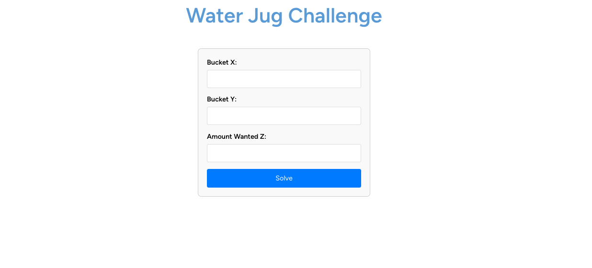

# Water Jug Challenge

An application using Laravel and React for the Water Jung Challenge

## Introduction

This project is an API that includes a backend built with Laravel and Laravel Sail, and a frontend build with Inertia + React + Typescript. The backend is containerized using Docker, allowing for easy deployment and management. 

## Table of Contents

- [Installation](#installation)
- [Usage](#usage)
- [Documentation](#documentation)

## Installation

### Prerequisites

- [Docker](https://www.docker.com/)

### Setup

1. **Clone the repository:**

    ```bash
    git clone git@github.com:francysreymer/water-jug-laravel-react.git
    cd water-jug-laravel-react
    ```

2. **Make the file deploy.sh executable:**

    ```bash
    chmod +x deploy.sh
    ```

7. **Then run the script:**

    ```bash
    ./deploy.sh
    ```
The application should now be runnig at [http://localhost/water-jug](http://localhost/water-jug).
You should see a page with form like this:



The frontend page is the file: resources/js/Pages/WaterJug.tsx
The backend controller is the file: app/Http/Controllers/WaterJugController.php

## Usage

- **Frontend:** Accessible at `http://localhost/water-jugs`.

## Documentation

- **Backend API Documentation**: Available via Swagger or Postman collection. The backend documentation should now be running at [http://localhost/api/documentation](http://localhost/api/documentation).

- **Explanation of the Algorithm Solution**: For detailed explanation, please refer to the [Water Jug Explaination](docs/breadth-first-search.pdf).
